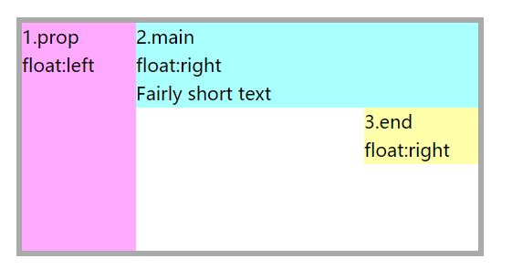
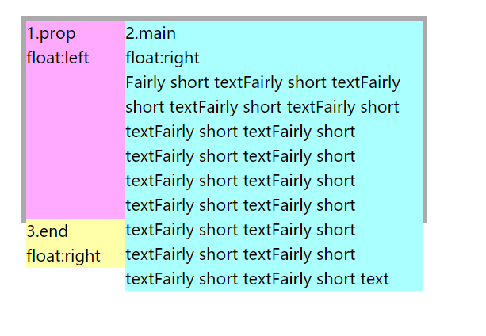
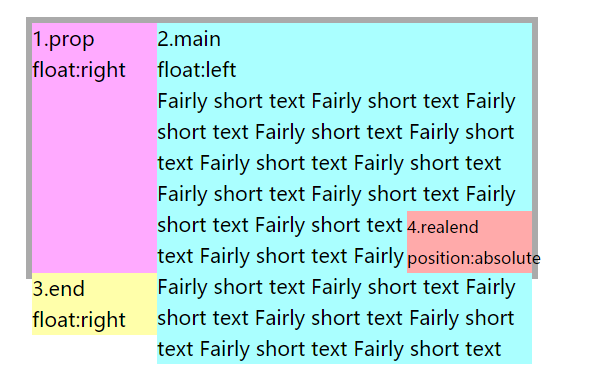
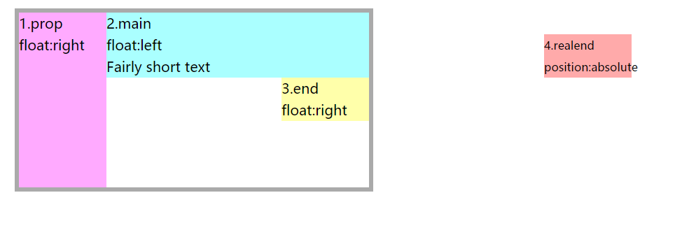
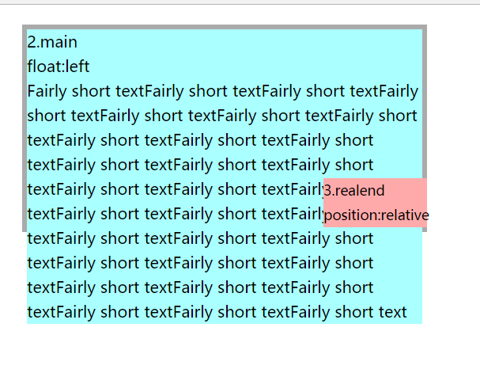
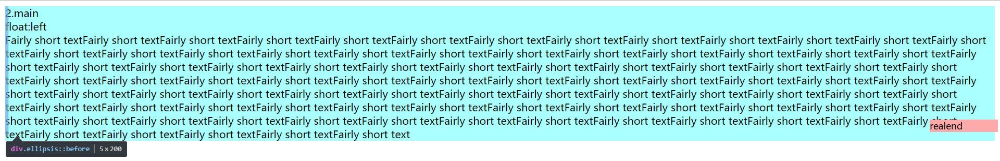
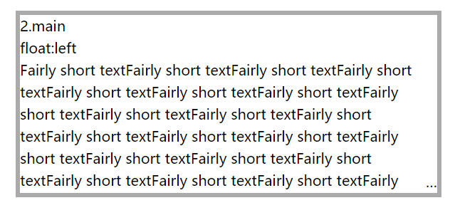

# CSS实现单行、多行文本溢出显示省略号
## 1. 单行文本省略
```
overflow:hidden;
text-overflow:ellipsis;
white-space:nowrap;
```
## 2. 多行文本省略
### 2.1 不兼容的css多行文本省略号(方法适用于WebKit浏览器及移动端)
三行文本省略号显示：
```
display:-webkit-box;
-webkit-box-orient:vertical;
-webkit-line-clamp:3;
text-overflow:ellipsis;
overflow:hidden;
```
WebKit提供的一个扩展属性`-webkit-line-clamp`,它不是css规范中的属性，利用该属性实现多行文本省略号显示需要配合其他三个属性display:-webkit-box、-webkit-box-orient、text-overflow:ellipsis;其中：
* -webkit-line-clamp设置块元素包含的文本行数
* display:-webkit-box;设置块元素的布局为伸缩布局
* -webkit-box-orient设置伸缩项的布局方向
* text-overflow:ellipsis;表示超出盒子的部分使用省略号显示

### 2.2 才用css规范中的属性实现多行文本省略号显示
1. 当父包含框比较小时，将子元素布局到父包含框的右下角：
```
<div class="wrap">
  <div class="prop">1.prop<br>float:left</div>
  <div class="main">2.main<br>float:right<br>Fairly short text</div>
  <div class="end">3.end<br>float:right</div>
</div>

.wrap {
  width: 400px; height: 200px;
    margin: 20px 20px 50px;
    border: 5px solid #AAA;
    line-height: 25px; 
}

.prop {
    float: left;
    width: 100px; height: 200px; 
    background: #FAF; }
.main {
    float: right;
    width: 300px; 
    background: #AFF; }
.end {
    float: right;
    width: 100px;
    background: #FFA; }
```


2. 我们通过创建一个子元素来替代将要显示的省略号，当文本溢出的情形下该元素显示在正确的位置上。在接下来的实现中，我们创建了一个realend元素，并利用上一节end元素浮动后的位置来实现realend元素的定位。
```
<div class="wrap">
  <div class="prop">
   1.prop<br>
   float:right</div>
  <div class="main">
   2.main<br>
   float:left<br>
   Fairly short text</div>
  <div class="end">
   <div class="realend">
     4.realend<br>
     position:absolute</div>
  3.end<br>float:right
  </div>
</div>

.end {
    float: right; position: relative;
    width: 100px;
    background: #FFA; }
.realend {
    position: absolute;
    width: 100%;
    top: -50px;
    left: 300px;
    background: #FAA; font-size: 13px; }
```
这一步中，我们主要关心的是realend元素的定位，基于浮动后的end元素设置偏移量，当end元素浮动到第一节第二章图的位置时（即在prop元素的下方），此时realend元素正好处在end元素的上方50px，右侧300px-100px=200px处，而该位置正是父包含框wrap元素的右下角，此时正是我们期待的结果：
<br/>
若父元素并没有溢出，那么realend元素会出现在其右侧

3. 优化定位模型
在第二节中，针对end元素设置了相对定位，对realend元素设置绝对定位。但是可以采用更为简单的代码来实现，即只使用相对定位。熟悉定位模型的应该知道，相对定位的元素仍然占据文本流，同时仍可针对元素设置偏移。这样，就可以去掉end元素，仅针对realend元素设置相对定位。
```
<div class="wrap">
  <div class="prop">1.prop<br>float:right</div>
  <div class="main">2.main<br>float:left<br>Fairly short text</div>
  <div class="realend">
  3.realend<br>position:relative</div>
</div>

.realend {
    float: right; 
        position: relative;
    width: 100px; 
    top: -50px; left: 300px;
    background: #FAA; font-size: 14px; }
```
4. 目前，最左侧的prop元素的作用在于让realend元素在文本溢出时处在其正下方，在前几节的示例代码中为了直观的演示，设置prop元素的宽度为100px，那么现在为了更好的模拟实际的效果，我们缩小逐渐缩小prop元素的宽度。
```
.prop {
    float: left;
    width: 5px; height: 200px; 
    background: #FAF; }
.main {
    float: right;
    width: 400px; 
    margin-left: -5px;
    background: #AFF; }
   .realend {
    float: right; 
        position: relative;
    width: 100px; 
    top: -50px; left: 400px;
    margin-left: -100px;
    padding-right: 5px;
    background: #FAA; font-size: 14px; }
```
针对prop元素，缩小宽度为5px，其余属性不变；
针对main元素，设置margin-left:5px，让main元素左移5px，这样main元素在宽度上就完全占满了父元素；
对于realend元素，top、left和width的值不变。而设置margin-left: -100px、padding-right: 5px则是为了让realend元素的盒模型的最终宽度计算为5px。
<br/>
5. 流式布局+伪元素
目前，realend元素的相关属性仍采用px度量，为了更好的扩展性，可以改用%替代。
同时，prop元素和realend元素可以采用伪元素来实现，减少额外标签的使用。
```
/*相当于之前的prop元素*/
.ellipsis:before { 
    content: "";
    float: left;
    width: 5px; height: 200px; 
    background: #F0F; }
/*相当于之前的main元素*/
.ellipsis > *:first-child {
    float: right;
    width: 100%; 
    margin-left: -5px;
    background: #AFF; }
/*相当于之前的realend元素*/
.ellipsis:after {
    content: "realend";
    float: right; position: relative;
    top: -25px; left: 100%;
    width: 100px; margin-left: -100px;
    padding-right: 5px;
    background: #FAA; font-size: 14px; }
 <div class="ellipsis">
  <div>2.main<br>float:left<br>Fairly short textFairly short textFairly short textFairly short textFairly short textFairly short textFairly short textFairly short textFairly short textFairly short textFairly short textFairly short textFairly short textFairly short textFairly short textFairly short textFairly short textFairly short textFairly short textFairly short textFairly short textFairly short textFairly short textFairly short textFairly short textFairly short textFairly short textFairly short textFairly short textFairly short textFairly short textFairly short textFairly short textFairly short textFairly short textFairly short textFairly short textFairly short textFairly short textFairly short textFairly short textFairly short textFairly short textFairly short textFairly short textFairly short textFairly short textFairly short textFairly short textFairly short textFairly short textFairly short textFairly short textFairly short textFairly short textFairly short textFairly short textFairly short textFairly short textFairly short textFairly short textFairly short textFairly short textFairly short textFairly short textFairly short textFairly short textFairly short textFairly short textFairly short textFairly short textFairly short textFairly short textFairly short textFairly short textFairly short textFairly short textFairly short textFairly short textFairly short textFairly short textFairly short textFairly short textFairly short textFairly short textFairly short textFairly short textFairly short textFairly short textFairly short textFairly short textFairly short textFairly short text</div>
</div>   
```

6. 隐藏
之前的实现中在文本未溢出的情况下，realend元素会出现在父元素的右侧，正如。解决此问题很简单，急需要设置：
```
.ellipsis{
  overflow:hidden;
}
```
7. 替换成...
现在离完结就差一步了，即去掉各元素的背景色，并且用“...”替换文本。最后为了优化体验，采用渐变来隐藏“...”覆盖的文本，并设置了一些兼容性的属性。
```
.ellipsis {
  overflow: hidden;
  height: 200px;
    line-height: 25px;
    margin: 20px;
    border: 5px solid #AAA; }

.ellipsis:before {
    content:"";
    float: left;
    width: 5px; height: 200px; }

.ellipsis > *:first-child {
    float: right;
    width: 100%;
    margin-left: -5px; }        

.ellipsis:after {
    content: "\02026";  

    box-sizing: content-box;
    -webkit-box-sizing: content-box;
    -moz-box-sizing: content-box;

    float: right; position: relative;
    top: -25px; left: 100%; 
    width: 3em; margin-left: -3em;
    padding-right: 5px;
    
    text-align: right;

  
        background-size: 100% 100%;
  /* 512x1 image, gradient for IE9. Transparent at 0% -> white at 50% -> white at 100%.*/  
    background: -webkit-gradient(linear, left top, right top,
        from(rgba(255, 255, 255, 0)), to(white), color-stop(50%, white));
    background: -moz-linear-gradient(to right, rgba(255, 255, 255, 0), white 50%, white);           
    background: -o-linear-gradient(to right, rgba(255, 255, 255, 0), white 50%, white);
    background: -ms-linear-gradient(to right, rgba(255, 255, 255, 0), white 50%, white);
    background: linear-gradient(to right, rgba(255, 255, 255, 0), white 50%, white);
}
```

