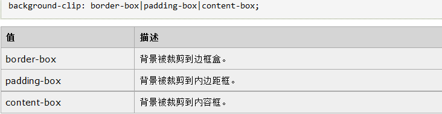
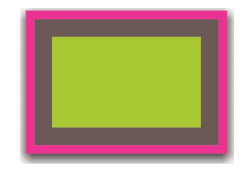
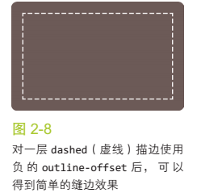

### 1.半透明边框 
[半透明边框](半透明边框.html)

    背景知识ＲＧＢＡ／ＨＳＬＡ颜色
    R：红色值。正整数 | 百分数 G：绿色值。正整数 | 百分数 B：蓝色值。正整数| 百分数 A：透明度。取值0~1之间
    H：Hue(色调)。0(或360)表示红色，120表示绿色，240表示蓝色，也可取其他数值来指定颜色。取值为：0 - 360
    S：Saturation(饱和度)。取值为：0.0% - 100.0%
    L：Lightness(亮度)。取值为：0.0% - 100.0%
    A：Alpha透明度。取值0~1之间



### 2.多重边框 
box-shadow: h-shadowv-shadowblurspreadcolor inset;

    h-shadow 必需。水平阴影的位置。允许负值。
    v-shadow 必需。垂直阴影的位置。允许负值。
    blur 可选。模糊距离。
    spread 可选。阴影的尺寸。
    color 可选。阴影的颜色。请参阅 CSS 颜色值。
    inset 可选。将外部阴影 (outset) 改为内部阴影

注意：box-shadow是层层叠加的，第一层投影位于最顶层，因此需要按此规律调整扩张半径。
```
background：yellowgreen；
box-shadow: 0 0 0 10px #655,
            0 0 0 15px deepink,
            0 2px 5px 15px rgba(0,0,0,.6);
```


* 投影的行为不会影响布局，也不会受到box-sizing属性的影响；也不会响应鼠标事件，如果需要就给box-shadow属性加上inset，来使投影绘制在元素的内圈，此时你需要增加额外的内边距来腾出足够的空间。

### outline方案
只需要两层边框，可以先设置一层常规的边框，在加上outline（m描边）属性来产生外出的边框,(这种方法的一大优点是在于边框样式灵活，不像上面的box-shadow方案只能模拟实线边框)
```
background：yellowgreen；
border:10px solid #655;
outline:5px solid deepink;
```
描边的另一个好处在于，你可以通过outline-offest属性来控制它跟元素边缘直接的间距，这个属性甚至可以接受负值。


* 注意通过outline属性实现的边框不会贴合元素的圆角，但是这一行为在未来可能发生变化
* outline不能接受用逗号分隔的多个值，所以需要更多层的边框只能用前一种方案了

### 3.灵活的背景定位
把背景图片定位到距离底边10px且距离右边20px的位置，以左上角偏移的思路，其实就是希望有一个100%-20px的水平偏移量，一个100%-10px的垂直偏移量`calc()`
```
background:url("") no-repeat;
background-position:calc(100% - 20px) calc(100% - 10px);
```

