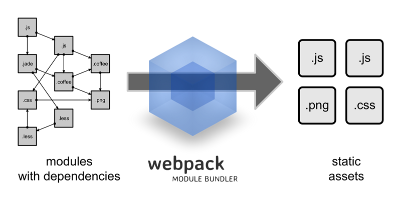

# Webpack从入门到上线
## 1. webpack 是什么

webpack 是为了解决什么问题？答案是：`文件依赖管理`。浏览器端的 Js, 出于安全的考虑，对本地文件没有操作权限，不能引用其它 js, css 等文件。而 webpack 就是用来解决这个问题的，让你的项目可以很好地分文件、分模块，而且它对外部文件的引入同时支持 cmd, amd 和 commondJs 这三种形式，够有诚意。
或许你要说了，解决文件依赖，早在 require.js 和 sea.js 的时候，都已经解决了呀！那么，webpack 在这方面，有哪些新的突破：
1. 支持引用各种拓展名的文件
1. 能够在不依赖 gulp 或 grunt 的情况下直接产出打包文件
1. 支持实时编译，浏览器同步刷新

## 1.1 使用webpack
写一个配置文件，然后执行下webpack，就可以把生成的文件输出，可压缩带版本号，同时生成一个source-map文件，这个文件包含了每个模块的js和css的实际(带版本号)路径，根据这个路径就可以把html里面的js/css等换成真实的路径。
webpack是一个打包的工具，它有一个重要的概念，就是把js/css/image/coffee都当成地位相等的资源，你可以在js里面require一个css，也可以require一个image。但是这种模式比较适用于React等框架，都是用js控制。

## 2. 安装与运行
目前，我们的项目目录结构是这样的：
```
webpack_demo
|--src
|  |--pages
|  |  |--index
|  |  |  |--index.js
|--views_dev
|  |--index.html
|--webpack.config.js
|--package.json
```
### 2.1 安装
在项目的根目录执行：
```
$ npm init // 生成项目依赖文件配置 package.json
$ npm install webpack -g // 全局安装webpack
$ touch webpack.config.js // 在项目根目录下，新建 webpack.config.js 文件
```
### 2.2 配置
然后，在以下3个文件，输入内容：
1. 页面 HTML 文件
```
// views_dev/index.html
<!DOCTYPE html>
<html>
<head>
    <meta charset="utf-8">
    <title>首页</title>
</head>
<body>
    <div>哈喽，world</div>
    <script src="../asset/dev/main.js"></script>
</body>
</html>
```
2. 页面引用的 js 文件
```
// src/pages/index/index.js
console.log('I am in index/index.js, haha4');
```
3. webpack 打包配置
```
// webpack.config.js
module.exports = {
// 入口：要进行处理的实例（js）
entry: './src/pages/index/index.js',
// 出口：输出配置
output: {
    // 打包输出到哪个目录
    path: './asset/dev/',
    // 静态资源的引用路径 webpack-dev-server访问的路径
    publicPath: '/asset/dev/',
    // 实例最终输出的名字
    filename: '[name].js'，
    chunkFilename: "bundle-[id].js"   //输出chunk文件名
}
};
```
### 2.3 运行
运行 webpack 命令，进行打包。
```
$ webpack
```
然后，搞定了，此时用浏览器打开` views_dev/index.html` 这个文件，你会发现，打包成功了！
## 3. 单个页面打包
这里，你将学到：
1. 引入其它 js 文件。是的，你将学会 模块化。
1. 引入其它类型的文件，以 css 为例。
1. 实时编译 + 浏览器同步刷新。
现在，我们的项目目录，是这样：
```
webpack_demo
|--src
|  |--pages
|  |  |--index
|  |  |  |--index.js
|  |  |  |--test.js
|  |  |  |--index.css
|  |--plugins
|  |  |--dialog
|  |  |  |--dialog.css
|  |  |  |--dialog.js
|--views_dev
|  |--index.html
|--webpack.config.js
|--package.json
```
### 3.1 引入其它 js 文件
1. 通过相对路径
现在，我们要在 src/pages/index.js 里面引入 src/pages/test.js 文件。这样做就可以了：
```
var Test = require('./test.js');
```
你也许会问，此时，var Test 这个变量，得到的是什么？换个说法，怎么控制 test.js 被导出到外部的内容。答案是：通过 module.exports. 例如：
```
// index/test.js
var str = "I am in test.js";
module.exports = str;
```
那么，require('./test.js') 的值就是 "I am in test.js" 这个字符串。module.exports 可以导出任何值。比如，我们要导出 Object.
```
module.exports = {
  aa: 'axxx',
  b: function() {}
};
```
2. 通过别名或模块
如果只能使用相对路径，那 webpack 就太不靠谱了。因为将有可能出现这样 ../../../../libs/libs-tost/toast.js, 啊，想死！那么，怎么通过别名引入文件呢？假如，我们想引入 src/plugins/dialog/dialog.js 这个弹窗。
在 webpack.config.js 中，配置别名
```
// webpack.config.js
module.exports = {
    resolve: {
        // 定义别名
        alias: {
            plugins: 'D:/your/path/webpack_demo/src/plugins', // 别名可以是目录
            myDialog: 'D:/your/path/webpack_demo/src/plugins/dialog/dialog.js' // 也可以是文件
        }
    }
}
```
可以使用了
```
// src/index/index.js
var Dialog = require('plugins/dialog/dialog.js'); // 方式一
var Diaglog = require('myDialog'); // 方式二
```
说明：`require(TagPath) `的 `TagPath` 如果以单词开头，将被认为是模块匹配，它会去找 `node_modules `和 `resolve.alias `下的模块（或别名）。以方式一为例，它的`TagPath` 是以` plugins `开头（注意下：`/plugins `和 `./plugins `都不叫以单词开头），所以可以顺利匹配到` resolve.alias.plugins`. 在实际应用中，你经常会看到 `require('jquery')`,` require('vue')`,` require('react')`, 这些就是匹配到` node_modules` 下已安装的模块。
### 3.2 引入其它类型的文件
webpack 的强大之处是，它允许你引入任何文件，比如：css, jpg, png. 那么，问题来了，对于不同的文件，它要怎么知道该如何分开处理呢？
```
// webpack.config.js
module.exports = {
    module: {
        loaders: [{
            test: /\.css$/,
            loader: 'style!css'
        }, {
            test: /\.js$/,
            loader: 'babel'
        }]
    }
};
```
上面的配置是说，对于拓展名是 `.css `的文件，使用加载器 style!css（这边中间有一个感叹号，意思是：先是用 `css` 加载器处理，然后使用 `style `加载器处理）。完整的写法是：`style-loader!css-loader`, 其中，`-loader`可以省略。而这里的，`style-loader `和 `css-loader` 就需要你 npm 安装下了。
```
$ npm i style-loader -D
$ npm i css-loader -D
```
对于其它拓展名的处理，也是用同样的方式来处理
### 3.3 释放双手：自动编译 + 浏览器同步刷新
1. 自动编译
如果你只是想支持自动编译，那么很简单。只要运行 $ webpack -w 就可以开启它的自动编译功能。
2. 用 webpack-dev-server 实现：自动编译 + 浏览器同步刷新
* 首先，你需要安装 webpack-dev-server 这个包。
```
$ npm i webpack-dev-server -D
```
* 然后，我简单介绍下它：[webpack-dev-server 文档](https://webpack.github.io/docs/webpack-dev-server.html)
	+ 运行时，它会启动一个本地 Node 服务器，默认端口8080. 即：localhost:8080. 并且自动识别当前目录下的 webpack.config.js 文件，来作为 webpack 配置文件。
	+ 产出的编译后文件，不在 output.path 里，而在它自己定义的内存。
	+ 行内参数说明：
		- inline: 使用命令行模式。
		- content-base: 指定网站的根地址，如果你想指定为项目根目录，那么 --content-base ./
		- hot: 开启热替换。一般用在 React 和 Vue 当中，我们这里不用。
好了，那么，启动它吧：
```
$ webpack-dev-server --inline --content-base ./
```
