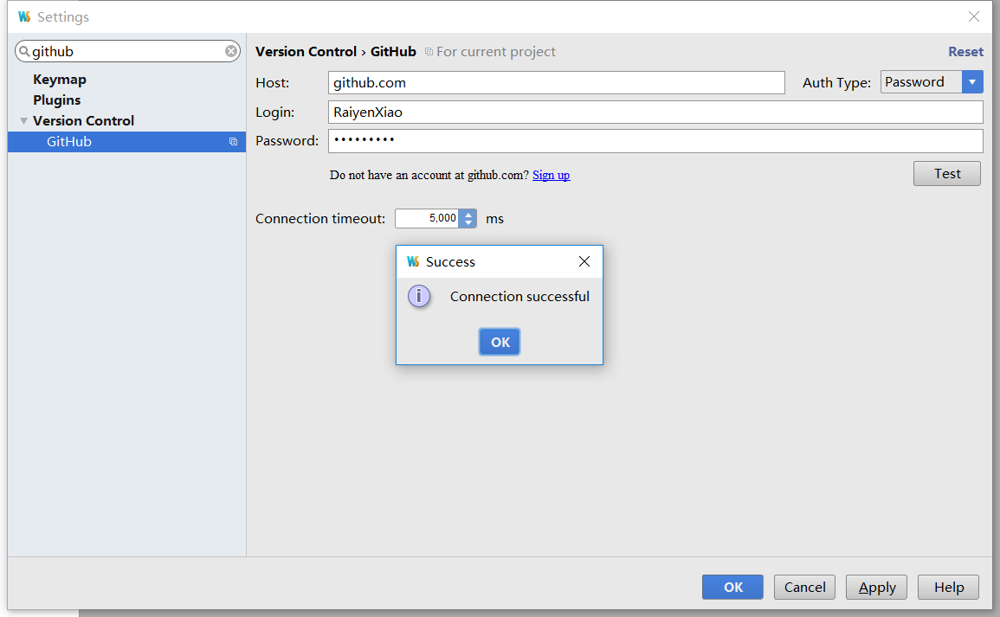
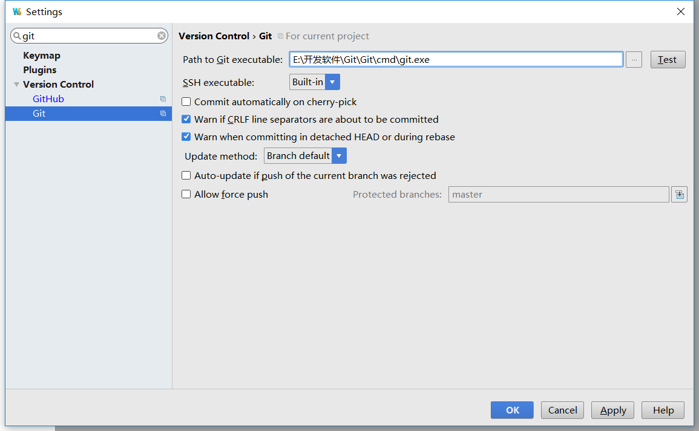

# Webstorm的一些操作笔记
## 1. 使用webstorm上传代码到github
打开webstorm，在file-settings中直接搜索github，然后输入自己github的账号密码，点击test，之后就会出来了 connection successful的提示框，说明已经可以连接到你的github账户了。

连接成功之后还需要连接下载的git，还是直接在settings中查找git，将git的安装路径输入，点击text，成功之后也会出来个connection successful的提示框
