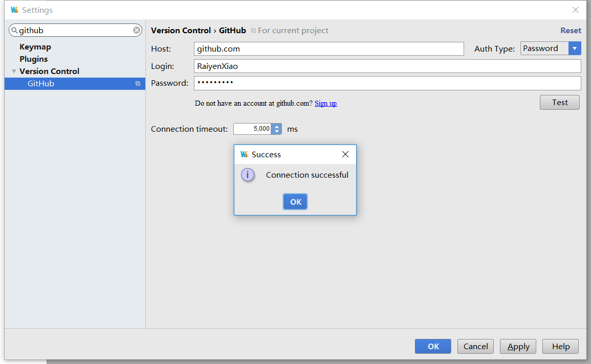
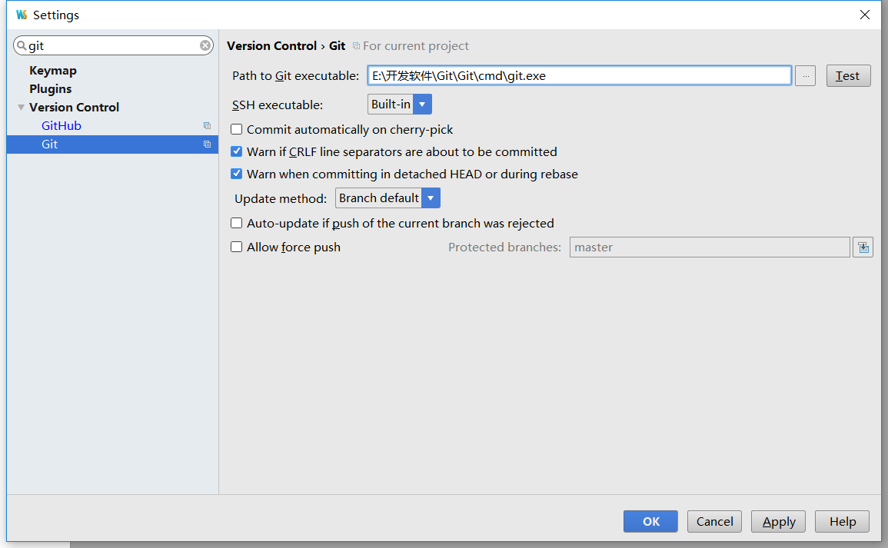
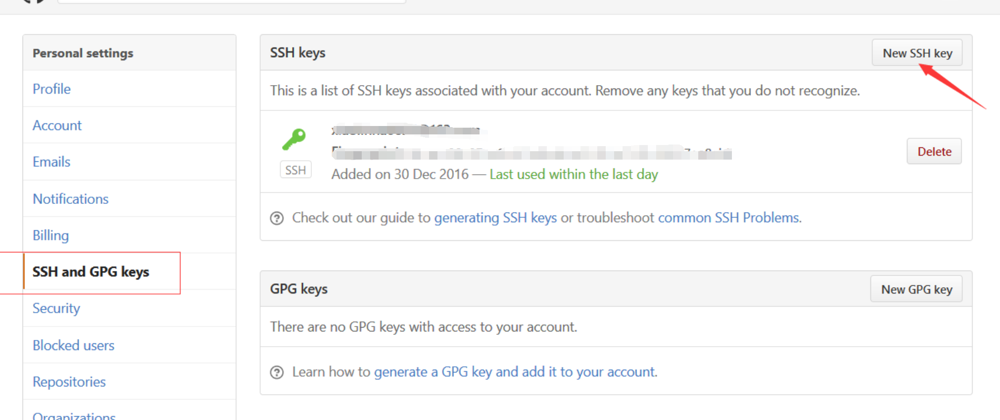
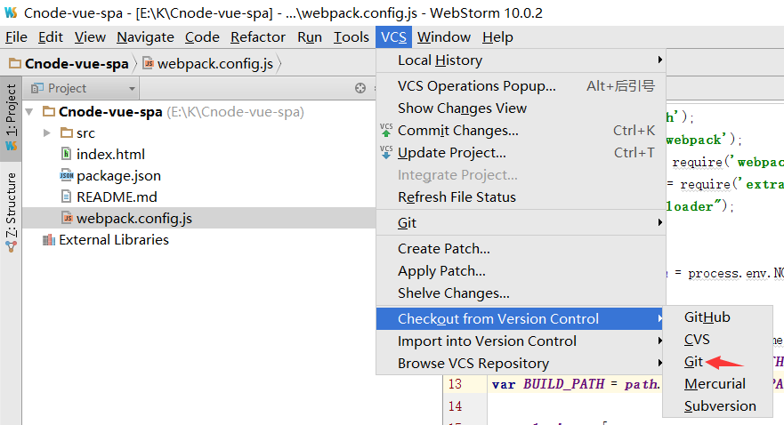

# Webstorm的一些操作笔记
## 1. 使用webstorm上传代码到github
打开webstorm，在file-settings中直接搜索github，然后输入自己github的账号密码，点击test，之后就会出来了 connection successful的提示框，说明已经可以连接到你的github账户了。

连接成功之后还需要连接下载的git，还是直接在settings中查找git，将git的安装路径输入，点击text，成功之后也会出来个connection successful的提示框

之后需要获取本地的ssh，复制到github账户中的ssh中，SSH的作用是让本地版本库与远程版本库通信，也就是你在本地修改好的代码，需要同步到服务器上的时候，就需要这个SSH密钥来通讯。如下：
1. 进入.ssh文件夹
```
cd ~/.ssh/
```
2. 如果没有可以手动创建一个.ssh文件夹
```
mkdir ~/.ssh
```
3. 配置全局的name和email,这里是githunb的用户名邮箱
```
git config --global user.name "XXX"
git config  --gloabal uesr.email "XXX"
```
4. 生成key
```
ssh-keygen -t rsa -C  "XXX"
```
根据提示输入密码
5. 用记事本打开id_ras.pub 复制内容到github setting

6. 测试是否成功添加
```
ssh git@github.com
```
提示“Hi lsyz0021! You've successfully authenticated, but GitHub does not provide shel l access.”说明添加成功。
准备工作做好之后就可以上传代码啦，打开webstorm，如图

点击克隆你的github仓库